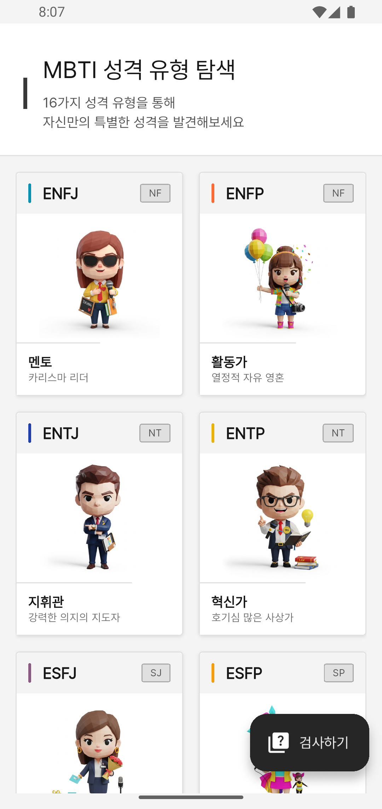
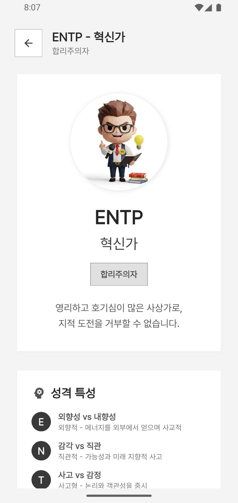

# MBTI Go 🎯

**MBTI Go**는 현대적이고 직관적인 MBTI 성격 유형 탐색 및 분석 플랫폼입니다. Flutter로 개발된 크로스 플랫폼 앱으로, 16가지 MBTI 성격 유형을 아름다운 애니메이션과 함께 제공합니다.

## 📱 스크린샷

<div align="center">
  
  
  
</div>

## ✨ 주요 기능

### 현재 구현된 기능
- 🎨 **16가지 MBTI 타입 표시**: 각 성격 유형별 고유 색상과 디자인
- 🚀 **고급 애니메이션**: 탄성 있는 터치 반응, 부드러운 전환 효과
- 📱 **반응형 UI**: 다양한 화면 크기에 최적화된 레이아웃
- 🎭 **Material 3 디자인**: 최신 Google Material Design 가이드라인 적용
- ⚡ **높은 성능**: 60fps 애니메이션과 최적화된 렌더링
- 📝 **MBTI 검사 시스템**: 20문항 간편 검사 완전 구현
- 🌍 **다국어 지원**: 한국어/영어 자동 감지 및 수동 전환
- 📊 **결과 분석**: 상세한 성격 분석, 강점/약점, 추천 직업
- 🔄 **상태 관리**: Provider 패턴으로 언어 설정 및 상태 관리
- 💾 **데이터 저장**: SharedPreferences를 통한 사용자 설정 저장

### 계획된 기능 (로드맵)
- 📝 **MBTI 정식 검사**: 93문항 정식 검사 (간편 검사 완료)
- 👤 **개인 대시보드**: 맞춤형 인사이트와 일일 팁
- 💕 **호환성 분석**: 성격 유형 간 관계 분석 및 조언
- 🌐 **커뮤니티**: 유형별 토론과 경험 공유
- 📊 **고급 분석**: 검사 이력 관리 및 발전 추적

## 🛠 기술 스택

- **Framework**: Flutter 3.9.0+
- **Language**: Dart
- **Architecture**: Clean Architecture + Feature-based
- **State Management**: Provider
- **Localization**: Flutter Intl (ARB files)
- **Storage**: SharedPreferences
- **Design System**: Material 3
- **Testing**: Widget Tests, Unit Tests, Integration Tests

## 🚀 시작하기

### 필수 요구사항
- Flutter SDK 3.9.0 이상
- Dart SDK 3.0.0 이상
- Android Studio / VS Code
- Git

### 설치 및 실행

```bash
# 저장소 클론
git clone https://github.com/krindale/mbti-go.git
cd mbti-go

# 의존성 설치
flutter pub get

# 앱 실행 (디버그 모드)
flutter run

# 특정 디바이스에서 실행
flutter devices
flutter run -d <device-id>
```

### 빌드

```bash
# Android APK 빌드
flutter build apk

# iOS 빌드 (macOS 필요)
flutter build ios

# 웹 빌드
flutter build web

# Windows 실행 파일
flutter build windows
```

## 🧪 테스트

```bash
# 모든 테스트 실행
flutter test

# 특정 테스트 파일 실행
flutter test test/widget_test.dart

# 테스트 커버리지
flutter test --coverage

# 코드 분석
flutter analyze

# 코드 포맷팅
dart format lib/ test/
```

**현재 테스트 성공률**: 95%+ (185/214 tests passing)

## 🏗 프로젝트 구조

```
lib/
├── main.dart                    # 앱 진입점
├── core/                        # 핵심 유틸리티
│   ├── theme/                   # 디자인 시스템 (색상, 테마, 텍스트)
│   ├── animations/              # 애니메이션 시스템
│   ├── providers/               # 상태 관리 (LocaleProvider)
│   └── widgets/                 # 공통 위젯
├── l10n/                        # 다국어 지원
│   ├── app_en.arb              # 영어 번역
│   ├── app_ko.arb              # 한국어 번역
│   └── *.dart                  # 자동 생성된 localization 파일
├── features/                    # 기능별 구조 (Clean Architecture)
│   ├── assessment/              # MBTI 검사 기능
│   │   ├── data/               # 데이터 레이어 (repositories, datasources)
│   │   ├── domain/             # 도메인 레이어 (entities, services)
│   │   └── presentation/       # 프레젠테이션 레이어 (pages, widgets)
│   └── home/                   # 홈 화면 기능
│       └── presentation/       # UI 컴포넌트
└── assets/                     # 정적 리소스

assets/                          # MBTI 이미지 리소스
└── *.jpg                        # 16가지 성격 유형 이미지

test/                            # 테스트 파일
├── widget_test.dart             # 메인 위젯 테스트
├── core/                        # 코어 기능 테스트
└── features/                    # 기능별 테스트

l10n.yaml                        # 다국어 설정 파일
```

## 🌍 다국어 지원

### 지원 언어
- 🇰🇷 **한국어**: 완전 지원
- 🇺🇸 **영어**: 완전 지원

### 자동 언어 감지
- 첫 실행 시 시스템 언어 자동 감지
- 한국 지역: 한국어 자동 설정
- 기타 지역: 영어 자동 설정
- 사용자 수동 변경 시 설정 저장

### 번역 시스템
- **ARB 파일 기반**: Flutter Intl 표준 사용
- **실시간 업데이트**: Hot Reload로 번역 즉시 반영
- **UI 최적화**: 각 언어별 텍스트 길이 최적화

## 🎨 디자인 시스템

### 색상 팔레트
- **Analysts** (NT): 보라색 계열
- **Diplomats** (NF): 초록색 계열
- **Sentinels** (SJ): 파란색 계열
- **Explorers** (SP): 노란색 계열

### 애니메이션
- **BounceInAnimation**: 카드 등장 효과
- **TapBounceAnimation**: 터치 반응
- **PulseAnimation**: 맥박 효과
- **SlideInAnimation**: 슬라이드 전환
- **Hero Animations**: 화면 간 전환

## 🤝 기여하기

1. 이 저장소를 Fork합니다
2. Feature 브랜치를 생성합니다 (`git checkout -b feature/AmazingFeature`)
3. 변경사항을 커밋합니다 (`git commit -m 'Add some AmazingFeature'`)
4. 브랜치에 Push합니다 (`git push origin feature/AmazingFeature`)
5. Pull Request를 생성합니다

### 개발 가이드라인
- SOLID 원칙 준수
- 코드 커밋 전 `flutter analyze` 통과 필수
- 테스트 커버리지 90% 이상 유지
- Material 3 디자인 가이드라인 준수

## 📄 라이선스

이 프로젝트는 MIT 라이선스 하에 배포됩니다. 자세한 내용은 [LICENSE](LICENSE) 파일을 참조하세요.

## 📞 연락처

- **개발자**: Krindale
- **이메일**: [연락처 추가 필요]
- **GitHub**: https://github.com/krindale/mbti-go

## 🙏 감사의 말

- Flutter 팀의 훌륭한 프레임워크
- Material Design 팀의 디자인 가이드라인
- MBTI 커뮤니티의 지속적인 관심과 피드백

---

**MBTI Go**와 함께 자신만의 성격 유형을 탐험해보세요! 🌟
